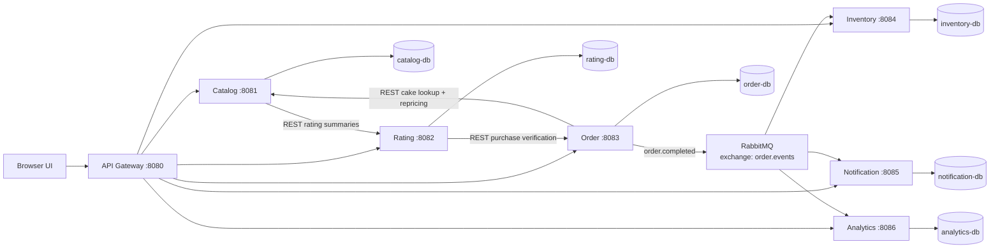

# Cake Delight architecture

Cake Delight is a Node.js microservices application. The API Gateway is the
only public entry point, and every service owns its own MySQL database.
Nothing reads another service's tables; all sharing happens over REST or over
the RabbitMQ event.

## Component view



| Service | Owns | Never touches |
| :--- | :--- | :--- |
| **Catalog** | Cake product data, categories, prices and catalogue availability/stock information | Orders, ratings tables |
| **Rating** | Reviews and star ratings | Cake data, order tables |
| **Order** | Baskets, orders, order items, outbox | Cake database tables |
| **Inventory** | Inventory reservations and reservation state | Order tables |
| **Notification** | Delivery records per channel | Order tables |
| **Analytics** | Aggregated sales metrics | Order tables |

## Synchronous calls

Three REST dependencies exist, and each one degrades rather than fails:

- **Catalog → Rating** enriches the cake list with average ratings. If the
  Rating Service is down the catalogue still returns cakes, with
  `averageRating: null`.
- **Order → Catalog** re-prices the basket at checkout against live catalogue
  data, so a price or availability change between "add to basket" and
  "checkout" cannot be exploited.
- **Rating → Order** verifies that the customer actually bought the cake on
  the order being reviewed. An unverified review is rejected with 403.

## Asynchronous flow

Checkout writes the order, the order items and an `order.completed` event row
into the **transactional outbox** in a single database transaction. A
background publisher then sends pending rows to RabbitMQ on a confirm channel
and only marks a row `PUBLISHED` once the broker acknowledges it.

This means the event can never be lost if the broker is down at checkout time,
and the customer's checkout never fails because of a messaging outage.

```
checkout ──┬─> orders            ┐
           ├─> order_items       │ one transaction
           ├─> basket cleared    │
           └─> outbox_events     ┘
                    │
        outbox publisher (every 5s, confirm channel)
                    │
                    ▼
       exchange order.events (topic, durable)
        routing key: order.completed
                    │
      ┌─────────────┼─────────────┐
      ▼             ▼             ▼
 notification.  inventory.   analytics.
 order.completed order.completed order.completed
```

Each consumer owns its queue and its dead letter queue. The Order Service
declares the exchanges only — if it also declared the consumers' queues, a
mismatch in dead letter arguments between the two declarations would make
RabbitMQ close the channel with `PRECONDITION_FAILED`.

## Reliability

| Concern | Mechanism |
| :--- | :--- |
| Database not ready at boot | 30 connection retries, then exit so the restart policy takes over |
| Broker not ready at boot | Consumers retry every 5s in the background; the REST API stays up |
| Broker connection drops | Consumers reattach automatically on the close event |
| Event lost between DB and broker | Transactional outbox + publisher confirms |
| Transient handler failure | 3 in-consumer retries with backoff before dead lettering |
| Poison message | Rejected without requeue, routed to the service's dead letter queue |
| Duplicate delivery | Idempotency keys: `event_id + channel`, `event_id` unique per reservation and per analytics row |
| Downstream service down | Gateway answers 503; catalogue degrades instead of failing |
| Request tracing | `X-Correlation-Id` is generated at the gateway and travels into the event |

## Identity

The browser sends a fixed demo customer id (`customer-1001`) in the
`X-Customer-Id` header, which the gateway forwards. Baskets, orders,
notifications and ratings are all scoped by that id. There is no shared user
database and no cross-service database access.
